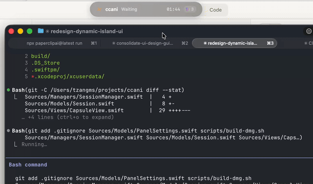

# Pulse for Claude Code

A macOS menu bar app that brings **Dynamic Island-inspired** real-time monitoring to your Claude Code sessions.



## Features

- **Dynamic Island Style** — A compact capsule UI floats above your screen, expanding on hover to show full session details
- **Real-time Session Tracking** — Monitor multiple Claude Code sessions simultaneously with working, waiting, or idle status
- **Elegant Animations** — Smooth expand/collapse, pulse effects on state changes, and frosted glass materials
- **Fully Local** — All data stays on localhost via Claude Code hooks. Nothing leaves your machine
- **Menu Bar Integration** — Quick controls from the system menu bar: show/hide, pin expanded view, adjust position
- **Sized to the Task** — A width slider (not just S/M/L type) and an action-detail setting, so a prompt you have to decide on can show its whole tool input
- **Permission Prompts in the Panel** — Answer Claude Code's permission requests with Allow / Allow all / Deny without switching to the terminal (opt-in)
- **Click to Jump Back** — Clicking a session focuses the terminal tab, pane, or editor window it is running in, or hands it to Claude for Desktop (Option-click forces that)
- **Push, Not Polling** — Claude Code posts events straight to the app over native HTTP hooks; no subprocesses, no file watching
- **Zero Configuration** — Automatically sets up Claude Code hooks on first launch

## Usage

Each session row carries a ring showing how full its context window is — the
same reading Claude Code reports, filling from the accent colour through amber
to red. Hovering gives the exact numbers (`756k / 1.0M (76%)`).

Account-wide limits sit in the panel's button row: the 5-hour window, the weekly
window, and the per-model weekly windows when a plan has them.
**Settings → Account Usage** turns that row off when it is not wanted.

Those limits come from Claude for Desktop, which samples them every few minutes
into `~/Library/Application Support/Claude/plan-usage-history.json`. Pulse reads
that file — the same numbers the desktop app displays — so nothing needs
configuring and no credentials or network calls are involved.

Claude Code itself reports limits only to its terminal status line, which never
runs for sessions hosted by Claude for Desktop: they have no REPL to draw one.
For terminal sessions, **Settings → Account Usage** also points `statusLine` at
`~/.ccani/statusline.sh`, which sends the payload to Pulse and prints the line
Pulse renders back. Pulse never asks for that on launch, because `statusLine`
holds a single command — turning the setting on replaces any status line already
configured, and Pulse deliberately does not record or run the command it
replaced. Turning it off gives the status line back *and* hides the limits,
which Pulse can otherwise still read from Claude for Desktop's records. Switching back means re-installing from whichever tool set
it; `~/.claude/settings.json` is backed up first.

Context readings fall back to the session transcript when the status line has
not reported yet. The transcript gives what was used but not the window size, so
that is inferred from the model — which the status line, when present, corrects.

## Sizing and Naming

**Settings → Width** sets the panel's width in points, independently of the
S/M/L type size, for when a session list or a command needs more room than a
step of the type scale gives.

**Settings → Action Detail** decides how much of a waiting permission prompt is
shown: a one-line summary, a few wrapped lines, or every field of the tool
input — a whole plan, a full command, both sides of an edit. Any single prompt
can be expanded on its own with the chevron in its corner, whatever the setting
says, and the bottom panel positions reserve more height as the setting grows.

**Settings → Session Name** switches session rows between the folder they run in
and the name Claude Code gives the session, read from its transcript, with the
folder underneath. Sessions Claude for Desktop runs never offer the prompt's
"Terminal" button — there is no terminal prompt waiting behind Pulse for them.

**Settings → Session Duration** turns the running clock on rows and in the
capsule off, for when only the state matters.

While collapsed, the capsule shows state as an animated glyph rather than a
word, so a long session name is not squeezed out by "Working...".

## Fullscreen

The panel joins every space so it follows you between desktops, which includes
the ones fullscreen apps own. With **Show Over Fullscreen** off it therefore
steps aside on its own: whenever the frontmost app has a window covering the
whole screen — a fullscreen space, or a video player filling it — the panel
hides until you leave. A waiting permission prompt overrides that and comes to
the front regardless.

## Session States

| State | Description |
|-------|-------------|
| **Working** | Claude is processing |
| **Waiting** | Waiting for user input or approval |
| **Idle** | Session is idle |
| **Stale** | No activity for over 10 minutes |

## Install

Download the latest DMG from [Releases](https://github.com/tzangms/ClaudePulse/releases/latest).

### Build from Source

```bash
git clone https://github.com/tzangms/ClaudePulse.git
cd ClaudePulse
swift build -c release
```

### Develop in Xcode

The Xcode project is generated from `project.yml` with [XcodeGen](https://github.com/yonaskolb/XcodeGen) and is not committed — edit `project.yml`, never the project file.

```bash
brew install xcodegen
./scripts/gen-xcode.sh
open ClaudePulse.xcodeproj
```

`project.yml` points at the `Sources` directory rather than listing files, so
**adding a file means re-running `./scripts/gen-xcode.sh`** — otherwise Xcode
compiles a project that has never heard of it and fails with
`Cannot find type ... in scope`, while `swift build` succeeds.

Run tests from either toolchain:

```bash
swift test
```

## How It Works

Pulse installs `type: "http"` hooks into `~/.claude/settings.json` pointing at
`http://127.0.0.1:19280/hook`. Claude Code POSTs each event directly to the app —
no `curl`, no polling — and reads the HTTP response as the hook's output.

That response channel is what makes in-panel permissions possible: when
**Answer Permissions in Pulse** is on, the app holds the `PermissionRequest`
hook open while it shows Allow / Allow all / Deny, then replies with the
decision. **Allow all** returns the same `permission_suggestions` Claude Code
would have offered in its own prompt, so the rule is persisted identically. If
nobody answers within the configured wait, Pulse replies with no decision and
Claude Code prompts in the terminal as usual.

Clicking a session uses whatever Pulse knows about it. When the hook headers
identify a terminal, that exact tab or pane is focused. Otherwise Pulse looks
for the session in Claude for Desktop and focuses it there, falling back to
simply bringing that app forward. Option-click always aims at Claude, and
**Settings → Reveal In** pins one target for every click.

Focusing a desktop session takes two steps, because the hook only ever reports
the Claude Code session id and the desktop app files its sessions under ids of
their own. Pulse reads the records in
`~/Library/Application Support/Claude/claude-code-sessions`, picks the live one
claiming that CLI session, and navigates to it with
`claude://claude.ai/epitaxy/<desktop-id>`.

Pulse never imports a session. `claude://resume?session=<id>` looks like the
link to use and is not: handed a session the app has no record of *under that
name*, it copies the transcript into a brand new session instead of focusing
anything — which is almost always, since the ids rarely match.

Every other event is answered immediately, with a 3 second hook timeout, so a
stopped or wedged Pulse can never stall a session.

Existing settings are backed up to `~/.claude/settings.json.ccpulse-backup`
before any change, and hooks from other tools are left untouched.

## Tech Stack

- Swift 5.10+ / SwiftUI / AppKit
- POSIX Sockets
- macOS 14+
- Swift Package Manager

## License

MIT

## Support

<a href="https://www.buymeacoffee.com/tzangms" target="_blank"></a>

## Author

Built by [@tzangms](https://github.com/tzangms)
